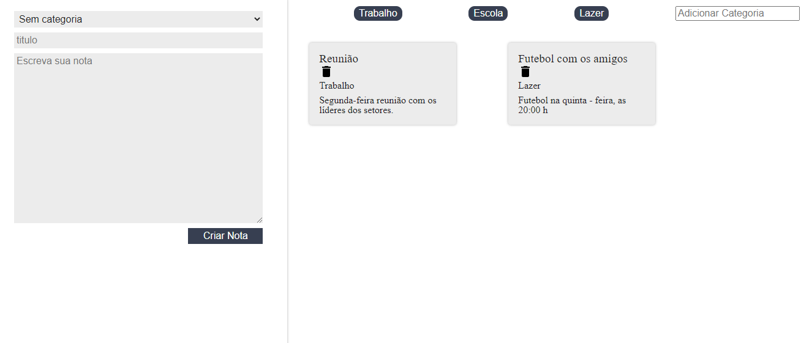

# Bloco de notas usando Reactjs

Projeto consiste em um bloco de notas, onde o usuario tem a opção de criar categorias.





## Como executar a aplicação 


- Caso não tenha instalado no seu terminal o pacote npm, execute o seguinte comando:

```

 npm install

```

- Navegar até a pasta executando:

```

 cd ./ceep

```

- Executar o projeto através do comando npm start:

```

npm start

```

## Motivação

Projeto com fins de estudo, utilizando o framework React. 

## Tecnologias Utilizadas

- React
- HTML
- CSS
- Visual Studio Code

## Autor

- Douglas Andrade dos Santos
